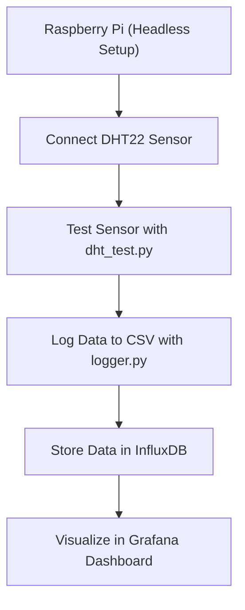

# DHT22 Environmental Data Logger & Dashboard

## Overview
This repository provides a complete workflow for collecting, storing, and visualizing environmental data (temperature and humidity) using a DHT22 sensor with a Raspberry Pi. The data is logged to a CSV file, stored in InfluxDB, and visualized using Grafana. This guide is designed for beginners and can be replicated by anyone interested in environmental monitoring projects.

---

## Table of Contents
1. [Hardware Requirements](#hardware-requirements)
2. [Headless Raspberry Pi Setup](#headless-raspberry-pi-setup)
3. [Wiring the DHT22 Sensor](#wiring-the-dht22-sensor)
4. [Software Setup](#software-setup)
5. [Testing the Sensor](#testing-the-sensor)
6. [Logging Data to CSV & InfluxDB](#logging-data-to-csv--influxdb)
7. [Importing Historical Data](#importing-historical-data)
8. [Visualizing Data with Grafana](#visualizing-data-with-grafana)
9. [Project Workflow](#project-workflow)
10. [Security Note](#security-note)

---

## Hardware Requirements
- Raspberry Pi (any model with GPIO)
- MicroSD card (8GB+)
- DHT22 temperature & humidity sensor
- Jumper wires
- Internet connection (for headless setup)

---

## Headless Raspberry Pi Setup
1. **Flash Raspberry Pi OS** to your microSD card using [Raspberry Pi Imager](https://www.raspberrypi.com/software/).
2. **Enable SSH**:
   - After flashing, create an empty file named `ssh` (no extension) in the boot partition of the SD card.
3. **Configure Wi-Fi**:
   - Create a file named `wpa_supplicant.conf` in the boot partition with your Wi-Fi credentials:
     ```
     country=US
     ctrl_interface=DIR=/var/run/wpa_supplicant GROUP=netdev
     network={
         ssid="YOUR_WIFI_SSID"
         psk="YOUR_WIFI_PASSWORD"
         key_mgmt=WPA-PSK
     }
     ```
4. Insert the SD card, power up the Pi, and find its IP address (check your router or use `nmap`).
5. SSH into your Pi:
   ```bash
   ssh pi@<raspberry_pi_ip>
   # Default password: raspberry (change it after first login!)
   ```

---

## Wiring the DHT22 Sensor
Connect the DHT22 sensor to the Raspberry Pi GPIO as shown below:


- **VCC** (DHT22) → **5V** (Pin 2 or 4 on Pi)
- **GND** (DHT22) → **GND** (Pin 6 on Pi)
- **Data** (DHT22) → **GPIO4** (Pin 7 on Pi)

---

## Software Setup
1. **Update your Pi:**
   ```bash
   sudo apt-get update && sudo apt-get upgrade
   sudo apt-get install python3-pip python3-dev libffi-dev
   ```
2. **Clone this repository:**
   ```bash
   git clone <your_repo_url>
   cd <repo_folder>
   ```
3. **Install Python dependencies:**
   ```bash
   pip3 install adafruit-circuitpython-dht influxdb
   ```
4. **Install and start InfluxDB:**
   - [InfluxDB Installation Guide](https://docs.influxdata.com/influxdb/v1.8/introduction/install/)
   - Start InfluxDB and create a database (e.g., `weather`).

---

## Testing the Sensor
Run the test script to verify your DHT22 sensor is working:
```bash
python3 dht_test.py
```
- The script prints temperature and humidity readings every 2 seconds.
- If you see errors, check your wiring and GPIO pin number in the script.

---

## Logging Data to CSV & InfluxDB
Run the main logger script:
```bash
python3 logger.py
```
- Logs data every 5 seconds (configurable in the script).
- Appends readings to `env_data.csv`.
- Writes data to InfluxDB for time-series storage.
- Log files (`dht_influx.log`, etc.) are created for troubleshooting.

**Configuration:**
- Edit the top of `logger.py` to set your InfluxDB host, port, username, and password:
  ```python
  INFLUX_HOST = "<your_influxdb_host>"
  INFLUX_PORT = <your_influxdb_port>
  INFLUX_DB = "weather"
  INFLUX_USER = "<your_username>"
  INFLUX_PASSWORD = "<your_password>"
  ```
- For security, use environment variables or a `.env` file in production.

---

## Importing Historical Data
If you have a CSV file of past data, import it into InfluxDB:
```bash
python3 import_csv.py
```
- Reads `env_data.csv` in batches.
- Cleans null bytes and skips invalid rows.
- Imports data into InfluxDB for analysis.

---

## Visualizing Data with Grafana
1. **Install Grafana:**
   - [Grafana Installation Guide](https://grafana.com/docs/grafana/latest/setup-grafana/)
2. **Add InfluxDB as a data source** in Grafana (use the same credentials as in your scripts).
3. **Create a dashboard:**
   - Add panels to visualize temperature and humidity over time.
   - Use the measurement `environment` and fields `temperature_C`, `humidity`.

---

## Project Workflow



---

## Security Note
- **Never commit real database credentials or sensitive information to public repositories.**
- Use environment variables or a secrets manager for production deployments.


